```mermaid
flowchart TD
    subgraph Cameras ["Eufy Devices"]
        C1["SoloCam 1 (HEVC)"]
        C2["SoloCam 2 (HEVC)"]
        C3["Doorbell (H.264)"]
    end

    subgraph Pi ["Raspberry Pi (utilitypi)"]
        WS["Docker: eufy-ws (:3000)"]
        PY["Python Bridge: eufy_rtsp_bridge.py<br/>TCP Loopback :9001, :9002, :9003"]
        G2R["go2rtc Restreamer<br/>RTSP :8554 | Web :1984"]
        
        WS -->|Raw NAL via WebSocket| PY
        PY -->|Raw TCP Stream| G2R
    end

    subgraph Clients ["Tailscale Mesh Clients"]
        CLI1["Phone Safari (:1984)"]
        CLI2["Desktop Brave (:1984)"]
    end

    Cameras -->|P2P UDP / Cloud Relay| WS
    G2R -->|WebRTC / MSE / RTSP| CLI1
    G2R -->|WebRTC / MSE / RTSP| CLI2
```

# Eufy Local Streaming Stack

Persistent, local RTSP/WebRTC bridge for Eufy security cameras running on a Raspberry Pi (`utilitypi`) over Tailscale.

---

## System Architecture

```text
+---------------------------------------------------------------------------------------------------+
|                                          LOCAL NETWORK / CLOUD                                    |
|                                                                                                   |
|   +--------------------+     +--------------------+     +--------------------+                    |
|   | SoloCam 1 (HEVC)   |     | SoloCam 2 (HEVC)   |     | Doorbell (H.264)   |                    |
|   | T8170T1125360152   |     | T8170T1125372768   |     | T8214511253325BB   |                    |
|   +---------+----------+     +---------+----------+     +---------+----------+                    |
|             \                          |                         /                                |
|              \           P2P (LAN UDP or Cloud Relay)           /                                 |
|               +------------------------+-----------------------+                                  |
|                                        |                                                          |
+----------------------------------------|----------------------------------------------------------+
                                         v
+---------------------------------------------------------------------------------------------------+
| Raspberry Pi (utilitypi: 10.0.0.66 / Tailscale: 100.68.193.42)                                    |
|                                                                                                   |
|   +-------------------------------------------------------------------------------------------+   |
|   | Docker Container: eufy-ws (Port 3000)                                                     |   |
|   | - Handles Eufy Cloud authentication & P2P session negotiation                             |   |
|   | - Exposes WebSocket API on ws://127.0.0.1:3000                                            |   |
|   +------------------------------------+------------------------------------------------------+   |
|                                        |                                                          |
|                               WebSocket Events & Raw NAL Stream                                   |
|                                        |                                                          |
|   +------------------------------------v------------------------------------------------------+   |
|   | Python Bridge: eufy_rtsp_bridge.py                                                        |   |
|   | - Subscribes to device live streams on ws://127.0.0.1:3000                                 |   |
|   | - Serves raw video frames over internal TCP loopback sockets:                             |   |
|   |     * 127.0.0.1:9001 (solocam1)                                                           |   |
|   |     * 127.0.0.1:9002 (solocam2)                                                           |   |
|   |     * 127.0.0.1:9003 (doorbell)                                                           |   |
|   +------------------------------------+------------------------------------------------------+   |
|                                        |                                                          |
|                            Raw TCP Video Stream Ingestion                                         |
|                                        |                                                          |
|   +------------------------------------v------------------------------------------------------+   |
|   | Media Server: go2rtc (go2rtc.yaml)                                                        |   |
|   | - Spawns on-demand FFmpeg workers: exec:ffmpeg -i tcp://127.0.0.1:900x                    |   |
|   | - Re-streams RTSP (:8554) and WebRTC/MSE/HLS HTTP Dashboard (:1984)                       |   |
|   +------------------------------------+------------------------------------------------------+   |
|                                        |                                                          |
+----------------------------------------|----------------------------------------------------------+
                                         |
                       Tailnet Access (100.68.193.42)
                                         |
        +--------------------------------+--------------------------------+
        v                                                                 v
+-------------------------------+                       +-------------------------------+
| Phone Safari (Tailscale)      |                       | Desktop Brave (Tailscale)     |
| http://100.68.193.42:1984     |                       | http://100.68.193.42:1984     |
| Low-latency WebRTC / MSE      |                       | Low-latency WebRTC / MSE      |
+-------------------------------+                       +-------------------------------+
```



---

## Service Management (systemd)

The streaming stack runs as a unified system service (`eufy-stream.service`) and automatically launches on system boot:

```bash
# Check service status and active feeds
sudo systemctl status eufy-stream.service

# View live streaming and pipeline logs
journalctl -u eufy-stream.service -f

# Stop or restart the entire streaming stack
sudo systemctl stop eufy-stream.service
sudo systemctl restart eufy-stream.service
```

---

## Operational Notes & Troubleshooting

### Eufy Cloud Password Resets & Session Invalidation
- **Token Invalidation:** Even if an account password is reset and promptly changed back to the original string, Eufy's backend immediately invalidates all active OAuth tokens, refresh tokens, and FCM push tokens.
- **Symptom:** `docker logs eufy-ws` outputs:
  `code: 26085, msg: 'token does not exist because the password has been reset'`
  followed by `No devices found`. Cameras disconnect after ~30s to conserve battery.
- **Resolution:**
  1. Stop services: `sudo systemctl stop eufy-stream.service && docker stop eufy-ws`
  2. Clear stale tokens: `rm -rf ~/Eufy/data/persistent.json ~/Eufy/data/token.json ~/Eufy/data/*session*`
  3. Start container to re-login: `docker start eufy-ws && docker logs -f eufy-ws`
  4. Once `MegaApi login ok` appears, restart the bridge: `sudo systemctl start eufy-stream.service`

### On-Demand P2P Battery Optimization
- Loopback sockets (`tcp://127.0.0.1:9001-9003`) remain idle with zero bytes while cameras sleep. Probing with `nc` will timeout unless a viewer has requested the feed.
- Video negotiation begins when a viewer connects to `go2rtc` (WebRTC, MSE, or RTSP). Initial P2P negotiation across cloud relays requires ~3-6s before frames flow.
