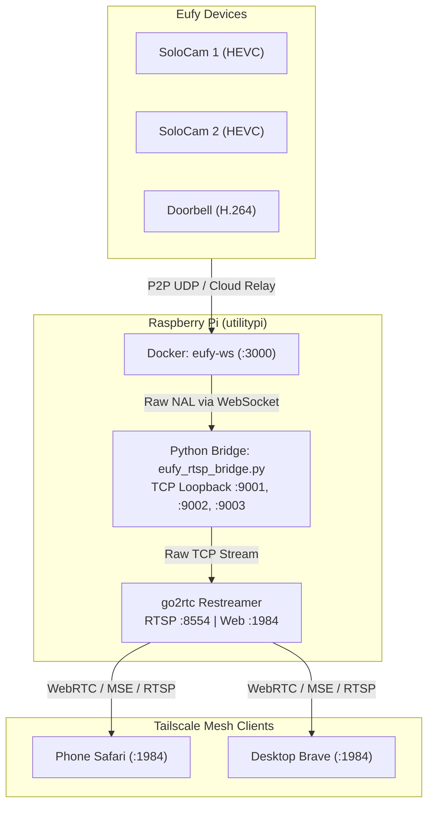

# Eufy Local RTSP & WebRTC Streaming Bridge

A low-latency, local-network video bridge running on a Raspberry Pi (`utilitypi`) to expose battery-powered and wired Eufy cameras (SoloCams and Doorbell) as standard R TSP and WebRTC feeds over Tailscale and local LAN.

---

># Architecture Overview

```text
Eufy Cloud / P2P
        │
        ▼
[eufy-security-ws] (Docker :3000)
        │  (WebSocket raw elementary H.264 / HEVC NAL units)
        ▼
[eufy_rtsp_bridge.py]
        │  (TCP loopback servers: 127.0.0.1:9001 - 9003)
        ▼
   (go2rtc] (Binary orchestrator)
        │  (exec:ffmpeg pulls loopback, packetizes, and restreams)
       ┌─────────────────────────────┌─────────────────────────────┑
       ▼                              ▼                              ▼
  RTSP (:8554)                   WebRTC (:8555)                 Web UI (:894)
  (VLC / ffplay)                 (Low-latency Web)              (Dashboard)
```

### Why This Design?
- **RTSP Push Ingestion Issues Avoided:** Directly pushing raw elementary NAL units from FFmpeg to an RTSP server triggers DTS/PTS timestamp discontinuities (`End of file` / `Broken pipe`).
- **Zero-Block TCP Loopback:** The Python bridge hosts local TCP streaming servers (`:9001` - `:9003`). `go2rtc` spawns `ffmpeg` as an on-demand `exec` consumer only when an active viewer connects.
- **Tailscale Accessible:** Services bind explicitly to `0.0.0.0` so they are reachable over Tailscale IP (`100.68.193.42`) and LAN (`10.0.0.66`).

---

## Directory Structure

```text
~/Eufy/
├──eufy_rtsp_bridge.py     # Python bridge (WebScocket -> TCP loopback)
├──go2rtc                 # go2rtc arm64 binary
├──go2rtc.yaml             # go2rtc streams & network configuration
‚꺇• 8• start_eufy_stack.sh     # Orchestrator script with cleanup handlers
┼── README.md
 ```

---

## Configuration Files

### 1. `go2rtc.yaml`
```yaml
api:
  listen: "0.0.0.0:1984"

rtsp:
  listen: "0.0.0.0:8554"

webrtc:
  listen: "0.0.0.0:8555"
  candidates:
    - "100.68.193.42:8555"

streams:
  solocam1:
    - exec:ffmpeg -hide_banner -loglevel warning -re -fflags +genpts+nobuffer -f hevc -r 15 -i tcp://127.0.0.1:9001 -c:v copy -an -f rtsp {output}
  solocam2:
    - exec:ffmpeg -hide_banner -loglevel warning -re -fflags +genpts+nobuffer -f hevc -r 15 -i tcp://127.0.0.1:9002 -c:v copy -an -f rtsp {output}
  doorbell:
    - exec:ffmpeg -hide_banner -loglevel warning -re -fflags +genpts+nobuffer -f h264 -r 15 -i tcp://127.0.0.1:9003 -c:v copy -an -f rtsp {output}
```

### 2. Stream Mapping
|size Feeds | Model | Codec | Local Ingest Port | RTSP URL |
| :--- | :--- | :--- | :--- | :--- |
| `solocam1` | T8170 (SoloCam) | HEVC (H.265) | `127.0.0.1:9001` | `rtsp://<host>:8554/solocam1` |
| `solocam2` | T8170 (SoloCam) | HEVC (H.265) | `127.0.0.1:9002` | `rtsp://<host>:8554/solocam2` |
| `doorbell` | T8214 (Dual Doorbell) | H.264 | `127.0.0.1:9003` | `rtsp://<host>:8554/doorbell` |

---

## Operating Instructions

### Launching the Stack (tmux)
Run the stack inside a persistent `tmux` session to ensure uninterrupted streaming:

```bash
tmux new -s eufy -d
tmux send-keys -t eufy "~/Eufy/start_eufy_stack.sh" C-m
```

To attach and monitor logs:
```bash
tmux attach -t eufy
```
To detach without stopping the feeds: press `Ctrl + b`, then `d`.

### Viewing Streams
- **Web Dashboard / WebRTC:** http://100.68.193.42:1984
- **Low-Latency CLI Playback:**
  ```bash
  ffplay -rtsp_transport tcp -flags low_delay "rtsp://100.68.193.42:8554/solocam1"
  ffplay -rtsp_transport tcp -flags low_delay "rtsp://100.68.193.42:8554/doorbell"
  ```

---

## Key Troubleshooting Takeaways

1. **Systemd Port Collision:**
   A background `go2rtc.service` daemon may automatically resurrect and bind `:8554` and `:1984` to `127.0.0.1`, ignoring stack config changes and causing `Connection refused` on external interfaces.
   - Fix: `sudo systemctl stop go2rtc && sudo systemctl disable go2rtc`
2. **WebSockets v14+ Compatibility:**
   `ClientConnection` objects in modern Python `websockets` do not expose `.closed`. Avoid checking `ws.closed` directly; rely on connection context managers or `.close_code`.
3. **FFmpeg Timestamps on Raw Elementary Streams:**
   Piping raw HEVC/H.264 NAL units without container timestamps requires `-fflags +genpts` and `-re` to pace frames at real-time speeds without saturating the `go2rtc` buffer.
# Eufy Local Streaming Stack

Persistent, local RTSP/WebRTC bridge for Eufy security cameras running on a Raspberry Pi (`utilitypi`) over Tailscale.

---

## System Architecture

```text
+---------------------------------------------------------------------------------------------------+
|                                          LOCAL NETWORK / CLOUD                                    |
|                                                                                                   |
|   +--------------------+     +--------------------+     +--------------------+                    |
|   | SoloCam 1 (HEVC)   |     | SoloCam 2 (HEVC)   |     | Doorbell (H.264)   |                    |
|   | T8170T1125360152   |     | T8170T1125372768   |     | T8214511253325BB   |                    |
|   +---------+----------+     +---------+----------+     +---------+----------+                    |
|             \                          |                         /                                |
|              \           P2P (LAN UDP or Cloud Relay)           /                                 |
|               +------------------------+-----------------------+                                  |
|                                        |                                                          |
+----------------------------------------|----------------------------------------------------------+
                                         v
+---------------------------------------------------------------------------------------------------+
| Raspberry Pi (utilitypi: 10.0.0.66 / Tailscale: 100.68.193.42)                                    |
|                                                                                                   |
|   +-------------------------------------------------------------------------------------------+   |
|   | Docker Container: eufy-ws (Port 3000)                                                     |   |
|   | - Handles Eufy Cloud authentication & P2P session negotiation                             |   |
|   | - Exposes WebSocket API on ws://127.0.0.1:3000                                            |   |
|   +------------------------------------+------------------------------------------------------+   |
|                                        |                                                          |
|                               WebSocket Events & Raw NAL Stream                                   |
|                                        |                                                          |
|   +------------------------------------v------------------------------------------------------+   |
|   | Python Bridge: eufy_rtsp_bridge.py                                                        |   |
|   | - Subscribes to device live streams on ws://127.0.0.1:3000                                 |   |
|   | - Serves raw video frames over internal TCP loopback sockets:                             |   |
|   |     * 127.0.0.1:9001 (solocam1)                                                           |   |
|   |     * 127.0.0.1:9002 (solocam2)                                                           |   |
|   |     * 127.0.0.1:9003 (doorbell)                                                           |   |
|   +------------------------------------+------------------------------------------------------+   |
|                                        |                                                          |
|                            Raw TCP Video Stream Ingestion                                         |
|                                        |                                                          |
|   +------------------------------------v------------------------------------------------------+   |
|   | Media Server: go2rtc (go2rtc.yaml)                                                        |   |
|   | - Spawns on-demand FFmpeg workers: exec:ffmpeg -i tcp://127.0.0.1:900x                    |   |
|   | - Re-streams RTSP (:8554) and WebRTC/MSE/HLS HTTP Dashboard (:1984)                       |   |
|   +------------------------------------+------------------------------------------------------+   |
|                                        |                                                          |
+----------------------------------------|----------------------------------------------------------+
                                         |
                       Tailnet Access (100.68.193.42)
                                         |
        +--------------------------------+--------------------------------+
        v                                                                 v
+-------------------------------+                       +-------------------------------+
| Phone Safari (Tailscale)      |                       | Desktop Brave (Tailscale)     |
| http://100.68.193.42:1984     |                       | http://100.68.193.42:1984     |
| Low-latency WebRTC / MSE      |                       | Low-latency WebRTC / MSE      |
+-------------------------------+                       +-------------------------------+
```



---

## Service Management (systemd)

The streaming stack runs as a unified system service (`eufy-stream.service`) and automatically launches on system boot:

```bash
# Check service status and active feeds
sudo systemctl status eufy-stream.service

# View live streaming and pipeline logs
journalctl -u eufy-stream.service -f

# Stop or restart the entire streaming stack
sudo systemctl stop eufy-stream.service
sudo systemctl restart eufy-stream.service
```

---

## Operational Notes & Troubleshooting

### Eufy Cloud Password Resets & Session Invalidation
- **Token Invalidation:** Even if an account password is reset and promptly changed back to the original string, Eufy's backend immediately invalidates all active OAuth tokens, refresh tokens, and FCM push tokens.
- **Symptom:** `docker logs eufy-ws` outputs:
  `code: 26085, msg: 'token does not exist because the password has been reset'`
  followed by `No devices found`. Cameras disconnect after ~30s to conserve battery.
- **Resolution:**
  1. Stop services: `sudo systemctl stop eufy-stream.service && docker stop eufy-ws`
  2. Clear stale tokens: `rm -rf ~/Eufy/data/persistent.json ~/Eufy/data/token.json ~/Eufy/data/*session*`
  3. Start container to re-login: `docker start eufy-ws && docker logs -f eufy-ws`
  4. Once `MegaApi login ok` appears, restart the bridge: `sudo systemctl start eufy-stream.service`

### On-Demand P2P Battery Optimization
- Loopback sockets (`tcp://127.0.0.1:9001-9003`) remain idle with zero bytes while cameras sleep. Probing with `nc` will timeout unless a viewer has requested the feed.
- Video negotiation begins when a viewer connects to `go2rtc` (WebRTC, MSE, or RTSP). Initial P2P negotiation across cloud relays requires ~3-6s before frames flow.
